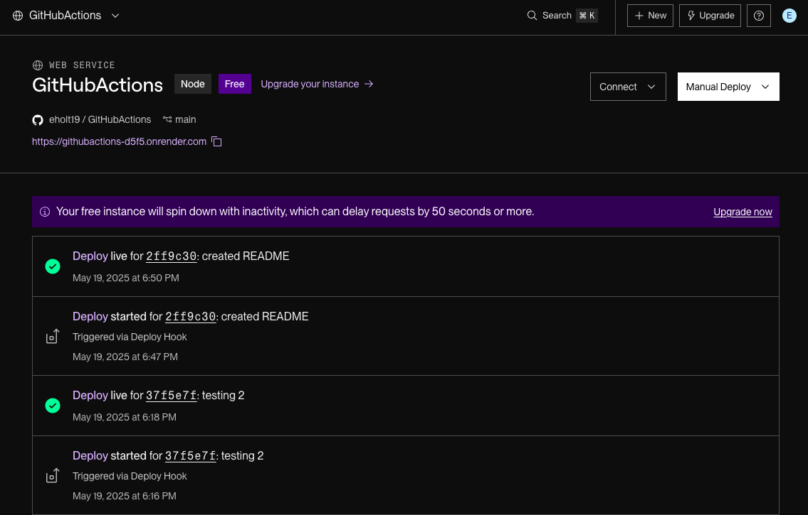
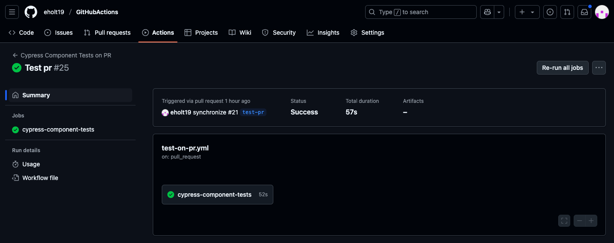

# GitHub Actions CI/CD Demo

This project demonstrates the use of GitHub Actions for Continuous Integration and Continuous Deployment (CI/CD) with Render.

## Project Overview

- **Frontend:** React (Vite)
- **Backend:** Node.js / Express (see `/server`)
- **Testing:** Cypress (component tests)
- **CI/CD:** GitHub Actions
- **Deployment:** [Render](https://githubactions-d5f5.onrender.com)

## Live Site

[View the deployed app on Render](https://githubactions-d5f5.onrender.com)

## GitHub Repository

[View this project on GitHub](https://github.com/eholt19/GitHubActions)

## How CI/CD Works

- **Cypress Tests on PR:**  
  When a Pull Request is made to the `develop` branch, GitHub Actions automatically runs Cypress component tests.
- **Deploy on Main:**  
  When code is pushed or merged to the `main` branch, GitHub Actions triggers a deploy on Render via a deploy hook.  
  This ensures that the latest version is always live.

## Automated Cypress Testing on Pull Requests

- Every Pull Request opened into the `develop` branch triggers a GitHub Actions workflow to run all Cypress component tests.  
- Test results appear in the PR checks and in the Actions tab for easy review.

## Screenshots

*Successful GitHub Actions Workflow:*



*Render Deploy Hook Event:*


*Cypress Component Testing:*




## How to Run Locally

1. Clone the repo:
    ```bash
    git clone https://github.com/eholt19/GitHubActions.git
    cd GitHubActions
    ```
2. Install dependencies and run the frontend:
    ```bash
    cd client
    npm install
    npm run dev
    ```
   To run the backend locally:
    ```bash
    cd ../server
    npm install
    npm run start
    ```
3. Open [http://localhost:5173](http://localhost:5173) in your browser.

## ⚡ Technologies Used

- React
- Vite
- Cypress
- GitHub Actions
- Render

## 📋 CI/CD Pipeline Summary

- **Test on PRs:** Cypress component tests are triggered for every pull request to `develop` and must pass before merging.
- **Automatic Deployment:** On merge or push to `main`, a GitHub Actions workflow calls the Render deploy hook to redeploy the app.

## 📑 Branch Strategy

- **main:** production deployment branch
- **develop:** integration branch; all features are merged here first
- **feature/\***: feature branches, PRs into `develop` only

## 📝 Assignment/Challenge Coverage

This project fulfills the following requirements:
- Cypress component tests run automatically on every PR to `develop` (CI).
- Auto-deploys to Render when `develop` is merged to `main` (CD).
- Uses `main` and `develop` branches per GitHub flow best practices.
- All workflows are visible in the Actions tab and PRs.
- _Note: At the time of submission, the deployed Render app loads but may not be fully functional due to [possible cold start/server deployment delay]._ (Remove or edit this line based on your actual experience!)

## License

MIT
